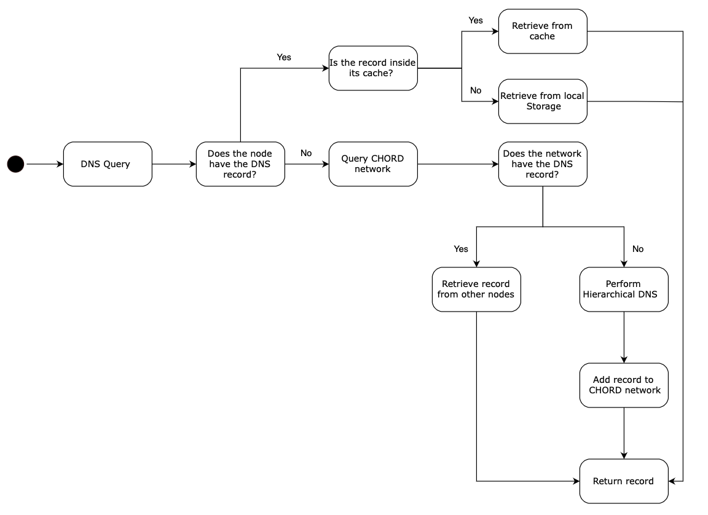
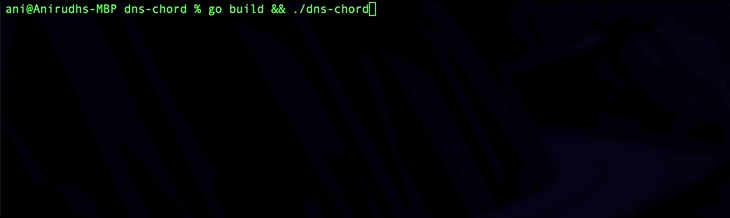
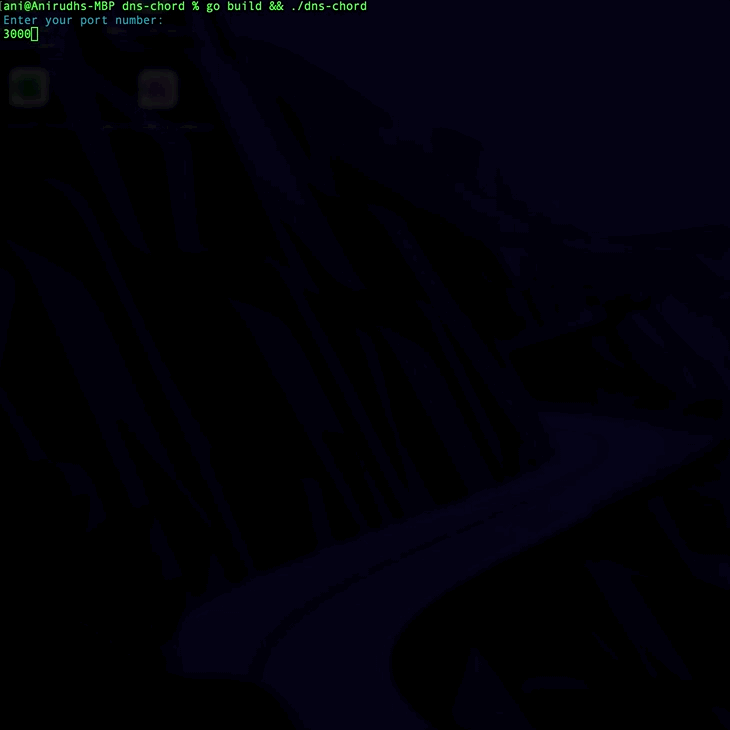
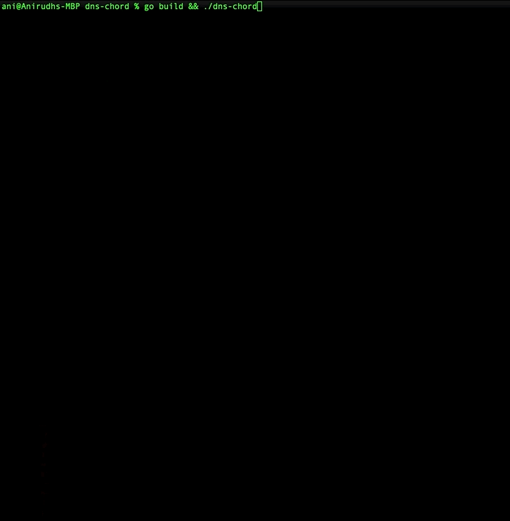
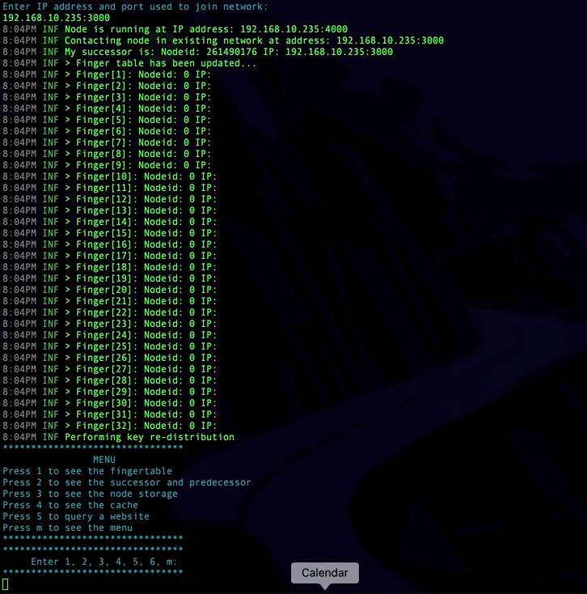
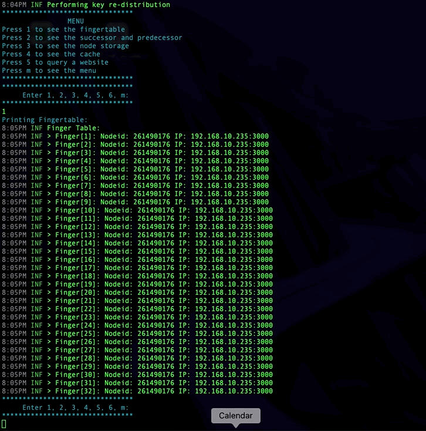
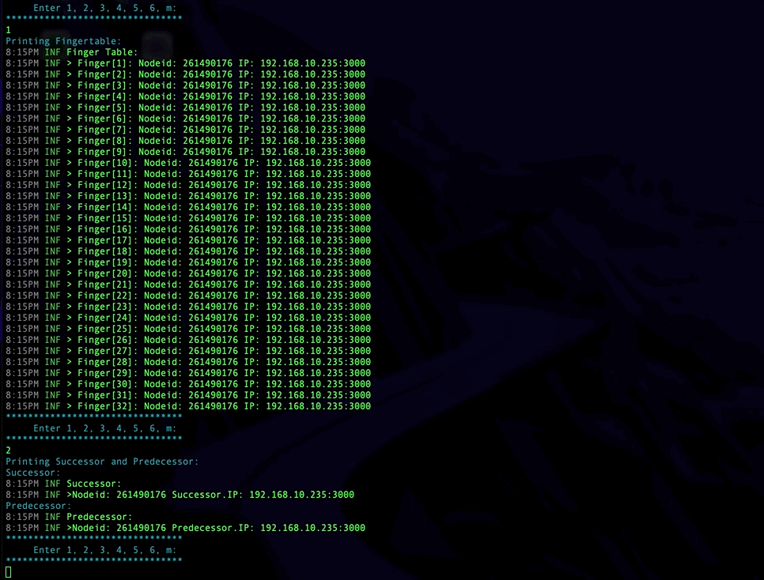
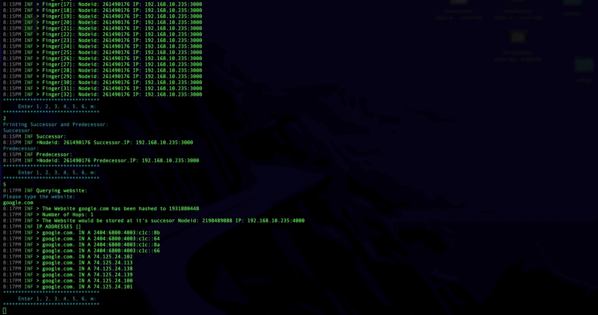
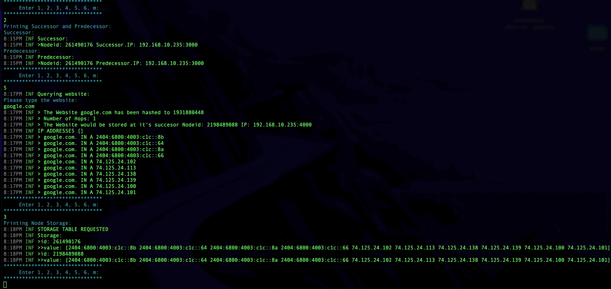
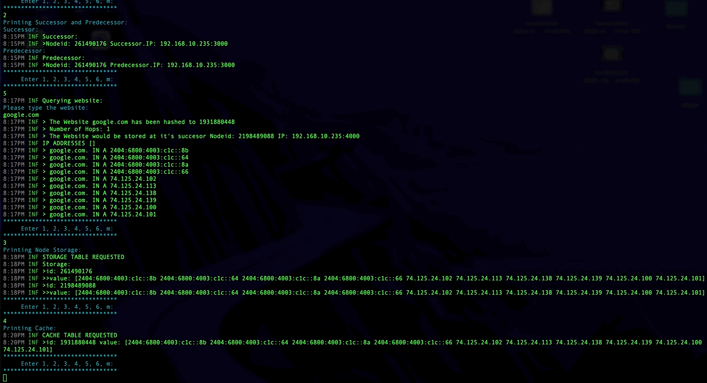

# dns-chord

<p align="center">
    
</p>

Implementing DNS functionality using chord framework

🚀 [Problem description](https://github.com/fauzxan/dns-chord/blob/main/documentation/problem-description.md)

🚀 [Documentation](https://pkg.go.dev/github.com/fauzxan/dns-chord/v2@v2.0.1)

<!--
🚀 [Report]()
-->
## System Architecture


Our DNS system builds on top of the Chord protocol, where multiple nodes store DNS records in their storage or local cache. When a user initiates a DNS query, the queried node retrieves the record from its local storage or cache if available. If the record is not present, the system locates the node holding the requested DNS record in the network. If found, that node returns the requested DNS record. Otherwise, a traditional DNS query is performed to obtain the record, which is then inserted into our network for future lookups.

## Setup

### Local setup
1. Install Go. If you haven't already, you may install it from [here](https://go.dev/doc/install).

2. Clone the repository
    - Open a terminal and clone the repository using the following command
    ```bash
    git clone https://github.com/fauzxan/dns-chord.git
    ```
3. Navigate to the cloned repository
    ```bash
    cd dns-chord
    ```
4. Open a terminal for each node you want in the network.
5. Build the project and run the dns-chord executable to start a node.
    ```bash
    go build && ./dns-chord
    ```
6. Upon running the command, you will be prompted to input the following information:
    - Your current port number: Enter the port number that you want the Chord node to use. This should be a valid port number (e.g., 3000).  

    
    - Full IP address of the node you're using to join the network:
        - If you are creating a new network, simply press `ENTER` or `RETURN`  

        
        - If you are joining an existing network, provide the full IP address of the node you want to connect to.  

        
7. We also designed a user-friendly interface to interact with the Chord node and gather information about its state, routing, storage, and cache.  

    - **Press 1** to display the fingertable of the current node.  

        
    - **Press 2** to view the successor and predecessor of the current node in the Chord network.  

        
    - **Press 5** to query a website using the DNS functionality implemented in the Chord protocol.  

        
    - **Press 3** to see the contents stored at the current node. This includes information about the DNS records or any data stored by the node.  

        
    - **Press 4** to see the cache - Includes cached results from previous DNS queries.  

        
    - Press m to see the menu  

        


### Docker setup
> Docker images are still in development phase!
To run docker container, just build docker image using 

```shell
    docker build --tag dns-chord-node .
```

Build a docker volume called mydata (This is not needed anymore)
```shell
    docker volume create mydata
```

If successfully built, then run, as well as to bind the volume with the container, run 

```shell
    docker run -v mydata:/app/data  -it dns-chord-node
```
Do note that the -it tag is important to enable interactivity and also see colored output.
This mounts the "mydata" volume to the "/app/data" path inside the container.

If you kill the container, then to restart it simply run:
```
docker start -ai <container_name>
```
You may close the terminal, and the container will still keep running in the background. You can confirm this behaviour via the log output of the container on docker desktop. 
